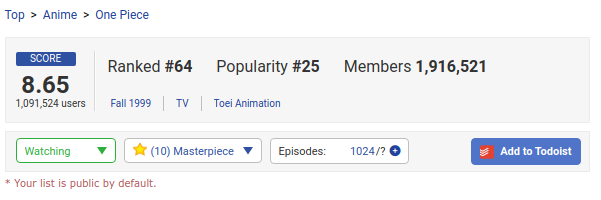
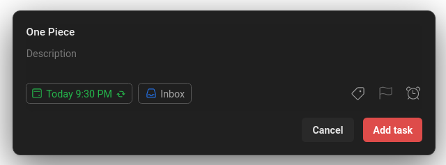
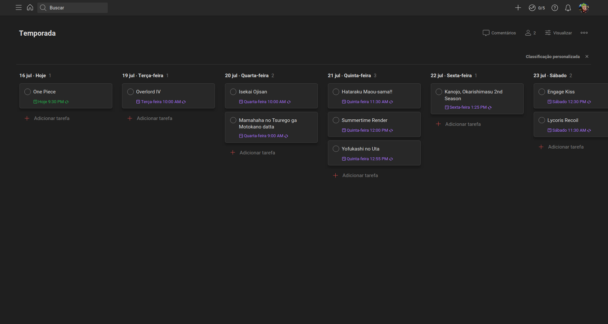

<h1 align="center"></img> MAL QuickAdd ⛩️</h1>

Quick add <strong>MyAnimeList</strong> entries to <strong>Todoist</strong>!

 
## 🌸 Demo
If you'd love to follow up seasonal animes but struggles with tons of Netflix, Funimation & Crunchyroll tabs open, this is one is for you: after setting up the extension you should be able to see an `Add to Todoist` button in MAL. Clicking this button will open Todoist's quick add panel in another tab with the series/movie name + broadcast recurrence's (if available) datetime in your local timezone:

MyAnimeList Button         |  Todoist Quick add panel
:-------------------------:|:-------------------------:
  |  

## 🍥 Setup
To setup the extension follow these steps:

1. Download the latest version from the [releases page](https://github.com/MateusAquino/mal-quickadd/releases/latest) or clone this repository;
2. Access `chrome://extensions`;
3. Enable **Developer Mode**;
4. Press **Load unpacked** to popup the folder selector;
5. Select MAL QuickAdd's repository.

## 🍜 Tips
I strongly recommend creating a new Project page & sorting by due date so you can have a nice board like this:

</img>

Thanks for using! :)
